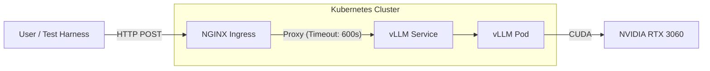
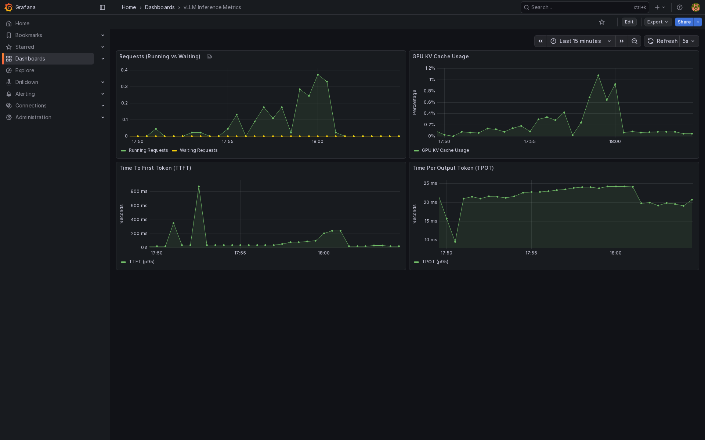

# GPU LLM Inference Platform: Project Overview

## 1. Project Scope
**Objective**: Deploy, optimize, and verify a production-grade LLM inference service using **vLLM** on Kubernetes (Minikube) with NVIDIA GPU acceleration (RTX 3060).

**Key Components**
- **Engine**: vLLM (TinyLlama-1.1B-Chat).
- **Infrastructure**: Minikube (Kubernetes 1.32), NGINX Ingress Controller.
- **Hardware**: Single NVIDIA GeForce RTX 3060 (12GB VRAM).
- **Testing**: `k6` (primary load testing), `nvidia-smi` (GPU monitoring). (`hey` was used early for baselines/debug.)

## Cluster Setup (Quick)
To ensure the NVIDIA driver loads correctly (avoiding Helm/device-plugin issues), start Minikube with GPU passthrough enabled:
```bash
minikube start --driver=docker --container-runtime=docker --gpus=all
minikube addons enable ingress
```

## Architecture



---

## 2. Project Phases (Documentation)

Each phase below links to a standalone Markdown doc intended to live under `./docs/`.

- [Phase 1 — Infrastructure Setup](docs/phase-1-infrastructure-setup.md)
- [Phase 2 — Initial Load Testing (hey)](docs/phase-2-initial-load-testing-hey.md)
- [Phase 3 — Investigation (The “Stall”)](docs/phase-3-investigation-stall.md)
- [Phase 4 — Stabilization (k6 + Ingress tuning)](docs/phase-4-stabilization-k6-ingress.md)
- [Phase 5 — Verification & Results (Matrix sweep)](docs/phase-5-verification-results.md)
- [Phase 5.5 — Tuning & Comparison](docs/phase-5-verification-results.md#results--tuned-phase-55-comparison)
- [Phase 6 — Advanced Verification (Stress Test)](docs/phase-6-advanced-verification.md)
- [Phase 7 — Reproducibility & Polish (Makefile)](walkthrough.md#reproducibility-phase-7)
- [Phase 8 — Observability Implementation](docs/phase-8-observability.md)
- [Phase 9 — Security (API Key Auth)](infra/k8s/apps/vllm/deployment.yaml)

Quick links:
- 📊 [Load Test Report](docs/load_test_report.md)
- 🧭 [Production Readiness Notes (Phase 6+ / future work)](docs/production_readiness.md)

---

## 3. Summary of Findings (High level)

### Phase 1: Infrastructure Setup
Deployed the initial vLLM service and exposed it via NGINX Ingress. Verified GPU scheduling on Minikube using the NVIDIA device plugin.

### Phase 2: Initial Load Testing (`hey`)
Established early baselines and discovered harness limitations.
- **Observation**: Short queries (64 tokens) scaled well with concurrency.
- **Issue**: Long queries (256 tokens) exposed client-side abort behavior and timeout interactions.

### Phase 3: Investigation (The "Stall")
Root-caused apparent “stalls” to **client-side request aborts** (NGINX `499`) and timeout behavior rather than vLLM deadlock.

### Phase 4: Stabilization
Improved test stability by tightening methodology (timeouts, request counts) and adjusting ingress proxy timeouts for long generations. Migrated load testing to `k6` for repeatable scripting and clearer error reporting.

### Phase 5: Verification & Results
Executed a full matrix sweep (Short vs. Long payloads, concurrency 1..16) and captured RPS, p95 latency, GPU utilization, and GPU memory.

### Phase 6: Advanced Verification (Stress & UX)
Pushed the system to **64 concurrent users**, achieving **48 RPS** (Short) and **15 RPS** (Long) with **0 errors**, proving extreme stability. Validated "Chat Feel" with a streaming probe, measuring **56ms** Time-To-First-Token (TTFT).

### Phase 7: Reproducibility
Created a unified `Makefile` for one-command deployment (`make deploy`) and benchmarking (`make benchmark`), ensuring consistent environments for all users.

### Phase 8: Observability
Implemented a "Glass Box" stack with **Prometheus**, **Grafana**, and **DCGM Exporter**.
- Real-time dashboards for GPU utilization, KV Cache usage, and Requests/sec.
- Added Latency histograms (TTFT, TPOT) for deep performance insights.

### Phase 9: Security (Authentication)
Secured the critical inference endpoint using **native vLLM API Key Authentication**.
- Created Kubernetes Secret `vllm-api-key`.
- Updated Deployment with `--api-key`.
- Validated via `curl` (401 vs 200) and Load Tests (`Authorization: Bearer ...`).

---

## 4. Documentation & Resources

### 📊 Performance Analysis
- [Load Test Report](docs/load_test_report.md)
  - Detailed breakdown of RPS, latency (p95), and GPU metrics for all concurrency levels.
- [Stress Test Report](docs/stress_test_report.md)
  - High-concurrency crash testing results (up to c=64).

### 🧭 Production Readiness (Phase 6+)
- [Production Readiness Notes](docs/production_readiness.md)
  - Planning notes for future work (observability, autoscaling, security). Not required for Phase 5 completion.

---

## 5. Quick Start: Running a Load Test

> These are reference commands; adapt paths/tooling to your repo layout.

### A) Short payload (example)
```bash
# short: 64 tokens
k6 run loadtest/k6_load_test.js \
  -e BASE_URL="http://llm.local/v1/chat/completions" \
  -e PAYLOAD_TYPE=short \
  -e VUS=4 -e ITERATIONS=192
```

### B) Long payload (example)
```bash
# long: 256 tokens
k6 run loadtest/k6_load_test.js \
  -e BASE_URL="http://llm.local/v1/chat/completions" \
  -e PAYLOAD_TYPE=long \
  -e VUS=2 -e ITERATIONS=96
```

### C) GPU monitoring during runs
```bash
nvidia-smi --query-gpu=timestamp,utilization.gpu,utilization.memory,memory.used,memory.total,temperature.gpu,power.draw \
  --format=csv -l 1 | tee loadtest/gpu_logs/run_$(date +%Y%m%d_%H%M%S).csv
```

### D) Monitoring & Observability
**Prometheus**: Scrapes vLLM metrics (port 8000) and GPU stats.
**Grafana**: Visualizes performance.
To access the Dashboard:
1. Port-forward Grafana:
   ```bash
   kubectl port-forward svc/prometheus-grafana -n monitoring 3000:80
   ```
2. Login at `http://localhost:3000`:
   - User: `admin`
   - Pass: `admin`
3. View **vLLM Inference Metrics** dashboard.



## Security: Authentication
The endpoint is now secured. You must provide the API Key (default: `sk-admin-token-12345`).

**To run k6 with Auth:**
```bash
k6 run loadtest/k6_load_test.js \
  -e BASE_URL="http://llm.local/v1/chat/completions" \
  -e API_KEY="sk-admin-token-12345" \
  -e PAYLOAD_TYPE=short -e VUS=1 -e ITERATIONS=10
```
