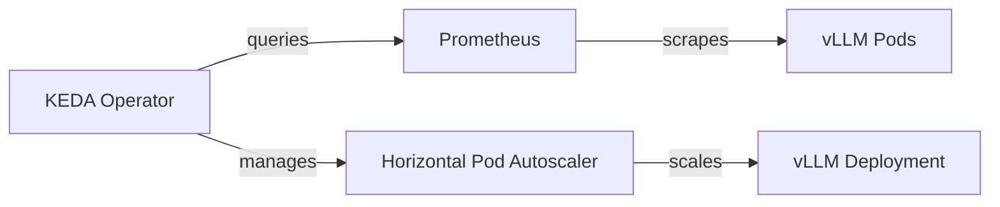

# Phase 12: Scaling Architecture Design

[Back to README](../README.md)

## Goal
Transition the single-node Minikube Proof-of-Concept (PoC) into a **Massively Scalable Production Platform**. This document outlines the architectural patterns for Horizontal Scaling (KEDA), Vertical Efficiency (MIG), and Distributed Inference (Multi-Node).

---

## 1. Horizontal Autoscaling (KEDA)
Standard Kubernetes HPA (CPU/Memory based) is ineffective for LLMs because GPU utilization spikes instantly and inference latency is non-linear. We use **KEDA (Kubernetes Event-Driven Autoscaling)** to scale based on the *queue depth* of incoming requests.

### Architecture


### The Golden Metric: `requests_waiting`
We scale based on `vllm:num_requests_waiting`.
- **Target**: **5**. (If >5 requests are queued, spin up a new GPU pod).
- **Zero-Scaling**: If `requests_waiting == 0` (and no active requests), scale to 0 (save $$$).

### Implementation Spec (`ScaledObject`)
```yaml
apiVersion: keda.sh/v1alpha1
kind: ScaledObject
metadata:
  name: vllm-autoscaler
spec:
  scaleTargetRef:
    name: vllm
  minReplicaCount: 1  # Keep 1 warm for low latency (or 0 for cost savings)
  maxReplicaCount: 10 # Limit based on GPU quota
  triggers:
  - type: prometheus
    metadata:
      serverAddress: http://prometheus-operated.monitoring:9090
      metricName: vllm_requests_waiting
      query: sum(vllm:num_requests_waiting{app="vllm"})
      threshold: "5"
```

---

## 2. Hardware Efficiency: Multi-Instance GPU (MIG)
Running a small 7B/8B model (~14GB VRAM) on a massive **NVIDIA A100 (80GB)** is wasteful.
- **Without MIG**: 1 Model per A100. 66GB VRAM wasted.
- **With MIG**: Slice A100 into **7 instances** (1g.10gb profile).

### Impact
- **Throughput**: **7x increase** per physical GPU.
- **Cost**: **85% reduction** in cost-per-inference.
- **Isolation**: Hardware-level isolation ensures one noisy tenant doesn't affect others' cache.

### Kubernetes Implementation
Use `nvidia.com/gpu` resource slicing via the NVIDIA Device Plugin:
```yaml
resources:
  limits:
    nvidia.com/mig-1g.10gb: 1 # Requests 1 slice, not whole card
```

---

## 3. Multi-Node Distribution (Ray)
For massive models (e.g., **Llama-3-70B**, **Grok-1**) that exceed single-GPU memory (even A100), we must split the model across multiple chips/nodes.

### Strategy: Tensor Parallelism (TP)
- **vLLM Integration**: Native support for Ray.
- **Setup**: Ray Head Node + Worker Nodes.
- **Execution**: The model weights are split matrix-wise. Every token generation requires an `AllReduce` operation across GPUs.

### Challenges & Solutions
1.  **Network Bandwidth**: TP requires massive interconnect speed (NVLink/InfiniBand).
    *   *Solution*: Keep TP within a single node (intra-node NVLink).
2.  **Scheduling**: All pods must start simultaneously.
    *   *Solution*: Kubernetes **Coscheduling Plugin** (PodGroup) to ensure "All-or-Nothing" scheduling.

---

## Summary of Next Steps
1.  **Immediate**: Implement **Phase 13 (Quantization)** to efficiency run 8B models on current hardware.
2.  **Day 2**: Deploy KEDA to production cluster.
3.  **Day 3**: Migrate to A100 nodes and enable MIG partitioning.
