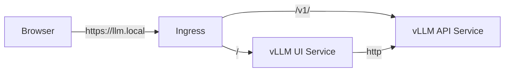

# Phase 14: User Interface (Streamlit Frontend)

[Back to README](../README.md)

## Goal
Provide a user-friendly Chat Interface for interacting with the vLLM inference engine, replacing the need for CLI `curl` commands.

## Architecture
The UI is a **Python Streamlit** application containerized with Docker.

## Implementation
### 1. Application (`web-ui/`)
*   **Framework**: Streamlit
*   **Client**: `openai` Python SDK (compatible with vLLM).
*   **Features**:
    *   Auto-detects models from vLLM.
    *   Streaming responses.
    *   Chat history.

### 2. Deployment
*   **Image**: Built locally in Minikube (`vllm-ui:latest`).
*   **Manifest**: `infra/k8s/apps/ui/deployment.yaml`.
*   **Ingress**: Updated `infra/k8s/apps/vllm/ingress.yaml` to route `/` to UI and `/v1/` to API.

## Verification
1.  **Build**: `eval $(minikube docker-env) && docker build -t vllm-ui:latest web-ui/`
2.  **Access**: Navigate to `https://llm.local/`.
3.  **Chat**: Send a query ("Who are you?") and verify the streaming response from Llama-3-8B.

## troubleshooting
If the UI cannot connect to the backend:
*   Ensure the `VLLM_API_BASE` env var in `infra/k8s/apps/ui/deployment.yaml` points to `http://vllm-service:8000/v1`.
*   Check Ingress logs for routing errors.
