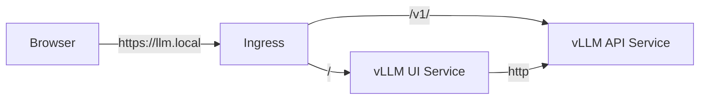

# Phase 14: User Interface (Streamlit Frontend)

[Back to README](../README.md)

## Goal
Provide a user-friendly Chat Interface for interacting with the vLLM inference engine, replacing the need for CLI `curl` commands.

## Architecture
The UI is a **Python Streamlit** application containerized with Docker.


## Implementation
### 1. Application (`web-ui/`)
*   **Framework**: Streamlit
*   **Client**: `openai` Python SDK (compatible with vLLM).
*   **Features**:
    *   Auto-detects models from vLLM.
    *   Streaming responses.
    *   Chat history.

### 2. Deployment
*   **Image**: Built locally in Minikube (`vllm-ui:latest`).
*   **Manifest**: `infra/k8s/apps/ui/deployment.yaml`.
*   **Ingress**: Updated `infra/k8s/apps/vllm/ingress.yaml` to route `/` to UI and `/v1/` to API.

## Verification
1.  **Build**: `eval $(minikube docker-env) && docker build -t vllm-ui:latest web-ui/`
2.  **Access (Recommended)**:
    Use Port Forwarding to bypass local network/DNS issues:
    ```bash
    kubectl port-forward svc/vllm-ui-service 8501:8501
    ```
    Then open [http://localhost:8501/](http://localhost:8501/).

3.  **Access (Alternative)**:
    If you have `minikube tunnel` running and `/etc/hosts` configured:
    Navigate to `https://llm.local/`.

4.  **Chat**: Send a query ("Who are you?") and verify the streaming response from Llama-3-8B.

## Troubleshooting
If `curl` or browser fails:
1.  **Check Ingress**: `kubectl get ingress -A` should show Address `127.0.0.1` or `192.168.x.x`.
2.  **Tunnel**: Ensure `minikube tunnel` is running on the host.
3.  **Hosts File**: Verify `llm.local` points to `127.0.0.1` (if tunnel) or `minikube ip` (if no tunnel).
4.  **Bypass**: Use `kubectl port-forward svc/vllm-ui-service 8501:8501` and access `localhost:8501`.
